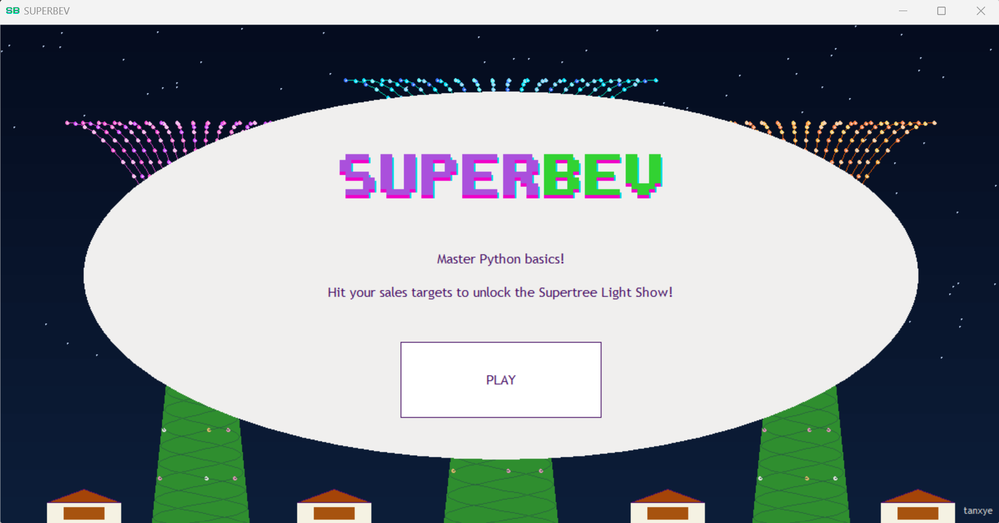

# SUPERtree BEVerages! (Superbev)
Watch gameplay: https://youtu.be/kQygGFkp2wU  



---

## How to Play

1. **Welcome Screen:** Click **PLAY** to begin your shift at the Gardens.
2. **Review Instructions:** You must answer the Python fundamentals questions correctly to secure your sales in order to activate the lightshow/garden rhapsody.
3. **Run the Shop:** Different customers will request random drinks. Select option **A** or **B** to solve the Python concept.
   * **Correct Answer:** The drink is sold! You earn the cash value towards your sales target.
   * **Incorrect Answer:** The customer leaves, and you miss out on the sale.
4. **The Ultimate Goal:** Get a flawless streak, earn **$45 or more**, and sit back to watch the dynamic Supertree Light Show celebrate your victory!

---

## Installation & Running the Game

### Windows

1. Click the green **Code** button → **Download ZIP** → **Extract All**
2. Open the extracted folder
3. Double-click **run_game.bat** to play (NOT the run_game.sh file but the run_game Windows Batch File)

> **Windows safety note:** Windows may show a SmartScreen warning since the file isn't from a signed publisher — this is normal for any student project. Click **"More info"** then **"Run anyway"**. You can open `run_game.bat` in Notepad anytime to verify it simply installs Python libraries and runs the game.

> **No Python?** The bat file will detect this and open the Python download page automatically. When installing Python, make sure to tick **"Add Python to PATH"** before clicking Install. Then double-click `run_game.bat` again.

---

### macOS

1. Click the green **Code** button → **Download ZIP** → extract the folder
2. Open **Terminal** (press ⌘ + Space, type Terminal, press Enter)
3. Type `cd ` (with a space after), then drag the extracted **superbev-main** folder from Finder into the Terminal window — it fills the path automatically. Press Enter.
4. Run the game:
```bash
   bash run_game.sh
```
   This automatically installs the required libraries and launches the game.

> **No Python?** The script will detect this and open the Python download page automatically. After installing, run `bash run_game.sh` again.

> **macOS security note:** If macOS says it cannot verify the developer, go to **System Settings → Privacy & Security** and click **"Allow Anyway"** next to the blocked file.

---

## The Concept & Creation Story

As a Singaporean student given a chance to be enrolled in the Stanford CIP 2026 course, I wanted to build a graphics-based game that uniquely represents home.

### The Inspiration

Gardens by the Bay frequently hosts vibrant pop-up stalls under its towering Supertrees. This inspired the core mechanics of the game: selling beloved local drinks (**Milo Dinosaur, Bandung, and Sugarcane**) packed in unique bottles shaped exactly like the Supertrees themselves!

### Development & Design Choices

* **Color Palette Accuracies:** The visual colors used throughout the user interface, tables, backgrounds, and tree models were carefully selected to match the real-life aesthetic of the **Supertree Grove** and the **Jurassic Nest Food Hall**.
* **Why local quiz logic over AI?** While I initially considered using `CallGPT` to dynamically generate questions, I ultimately decided against it to eliminate the risks of API instability, network latency, and rigid call limitations. Instead, I built a reliable, randomized native Python quiz engine to test core coding fundamentals.
* **The Light Show Challenge:** Programming the mathematical animations for the Supertree Light Show was the most complex part of the project, taking **3 full days of dedicated coding** to perfect the Bezier curves, overlapping sine waves, and twinkling LED coordinate matrices.

In total, this project took **4 to 5 days** of continuous iteration from its initial whiteboard concept to this final, polished copy.

### Stanford Code In Place IDE Gameplay urls

**Not Full Game**  

https://codeinplace.stanford.edu/cip6/share/94DY9fjTUumNTA1xWhIk  

**Mini Singapore Advert (First CIP Graphics Project)**  

https://codeinplace.stanford.edu/public/share/W7iaN6DSsB8eN9GmxwJM  


